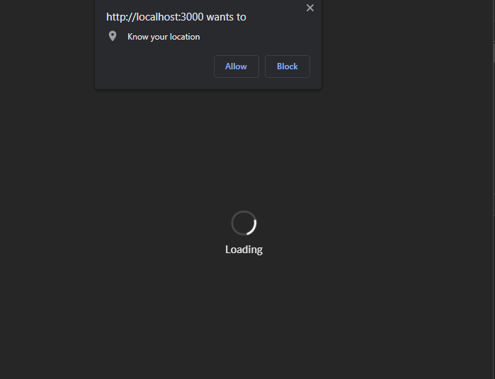
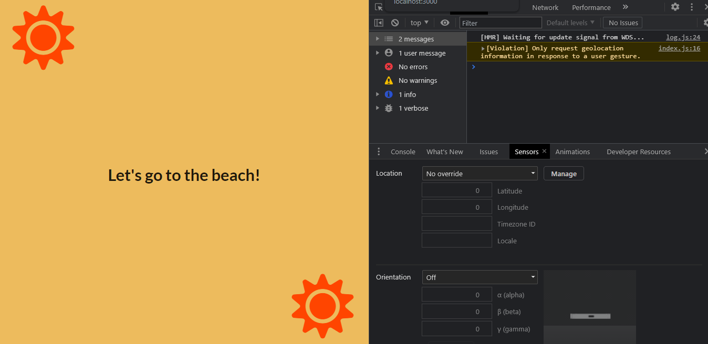
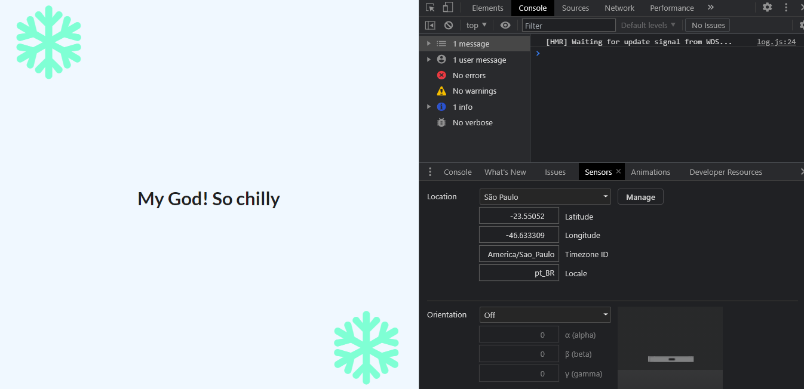

# Based on the location of the user this web app will find if there is Summer or Winter 

## How this React app works? 

### When the app loads it asks for allowing location. A loading spinner is used in this time with the help of Semantic UI. 

### When the location is allowed by the user it reads the latitude based on the location of the user using window.navigator.geolocation.getCurrentPosition(), then it detects wheather the users location is in northern hemisphere or southern hemisphere. Then finally it gives the result: Summer or Winter based on the location and based on the ongoing month

### If we change the location manually by the sensors tab, and make it a city of Southern hemisphere then it is going to give us the expected result Winter 

